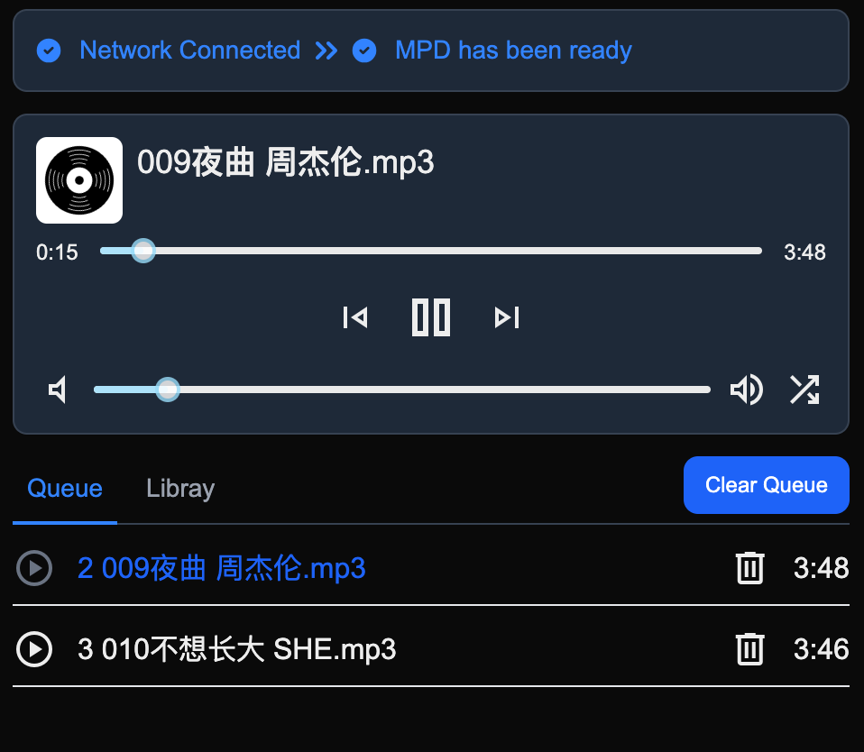

这是一款基于 MPD 的客户端播放器，使用 Nextjs 开发，支持：

* 播放/暂停
* 下一首/上一首
* 更改音量
* 更改播放模式
* 清空播放队列
* 从 Database 中添加歌曲



## 什么是 MPD

MPD 是 [Music Player Daemon](https://www.musicpd.org/) 缩写。

Music Player Daemon (MPD) is a flexible, powerful, server-side application for playing music. Through plugins and libraries it can play a variety of sound files while being controlled by its network protocol.

## 部署

请使用 Docker 部署

```sh
version: '3.9'
  services:
    mpd-player:
      image: xbf321/mpd-player:latest
      container_name: mpd-player
      restart: unless-stopped
      ports:
        - 7180:7180
      environment:
        # 登录用户名和密码默认都是 test
        - AUTH_USER_NAME=test
        - AUTH_USER_PASSWORD=test
        - MESSAGE_PUSHER_SERVER_TOKEN=token
        # CloudConvert 访问 token ，用于把 word 格式转换为 pdf 格式
        - CLOUDCONVERT_ACCESS_TOKEN=token
```


## 开发

First, run the development server:

```bash
pnpm run dev
```

推荐使用 PNPM。

Open [http://localhost:7180](http://localhost:7180) with your browser to see the result.

## WS Command

```js
{ "type": "PLAY"}
{ "type": "PAUSE"}
{ "type": "REQUEST_STATUS"}
{ "type": "REQUEST_ELAPSED"}
{ "type": "GET_VOL"}
{ "type": "SET_VOL","data": 20}
{ "type": "REPEAT","data": true}
{ "type": "RANDOM","data": true}
{ "type": "QUEUE"}
playlistinfo


```

## 参考

https://github.com/ondras/cyp/blob/master/app/js/mpd.ts

## Learn More

To learn more about Next.js, take a look at the following resources:

- [Next.js Documentation](https://nextjs.org/docs) - learn about Next.js features and API.
- [Learn Next.js](https://nextjs.org/learn) - an interactive Next.js tutorial.

You can check out [the Next.js GitHub repository](https://github.com/vercel/next.js) - your feedback and contributions are welcome!

## Deploy on Vercel

The easiest way to deploy your Next.js app is to use the [Vercel Platform](https://vercel.com/new?utm_medium=default-template&filter=next.js&utm_source=create-next-app&utm_campaign=create-next-app-readme) from the creators of Next.js.

Check out our [Next.js deployment documentation](https://nextjs.org/docs/app/building-your-application/deploying) for more details.
